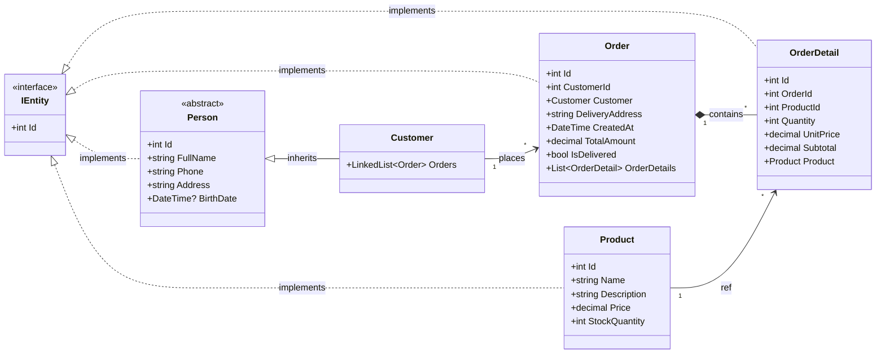

# Panadería Bendt - Actividad 3 de Estructuras de Datos

Proyecto desarrollado en **ASP.NET Core MVC (.NET 10)** para la materia **Estructuras de Datos**. La aplicación combina la persistencia de datos relacional con la implementación práctica de estructuras dinámicas en memoria para resolver casos de uso reales de una panadería.


## 🛠️ Tecnologías Utilizadas

* **Framework:** .NET 10 (ASP.NET Core MVC)
* **Lenguaje:** C#
* **ORM:** Entity Framework Core
* **Base de Datos:** SQLite (`Panaderia.db`)
* **Arquitectura:** Modelo-Vista-Controlador (MVC)
* **IDE usado:** Rider


## 📂 Estructura del Proyecto

```text
├── Controllers/
│   ├── BakeryController.cs       # Gestión de colas, pilas y listas
│   ├── CustomerController.cs     # Gestión de clientes
│   ├── ProductController.cs      # Gestión de catálogo de productos
│   └── HomeController.cs         # Controlador principal
├── Data/
│   ├── MemoryStore.cs            # Instancias globales de las estructuras en memoria
│   └── PanaderiaDbContext.cs     # Contexto de Entity Framework Core
├── Models/
│   ├── classes/
│   │   ├── DateStructures/       # Implementación propia de estructuras de datos
│   │   ├── Customer.cs
│   │   ├── Order.cs
│   │   ├── OrderDetail.cs
│   │   ├── Person.cs
│   │   └── Product.cs
│   └── interfaces/               # Ej: IEntity
└── Views/                        # Vistas Razor del sistema
```

## 📐 Diagrama de Clases (UML)


